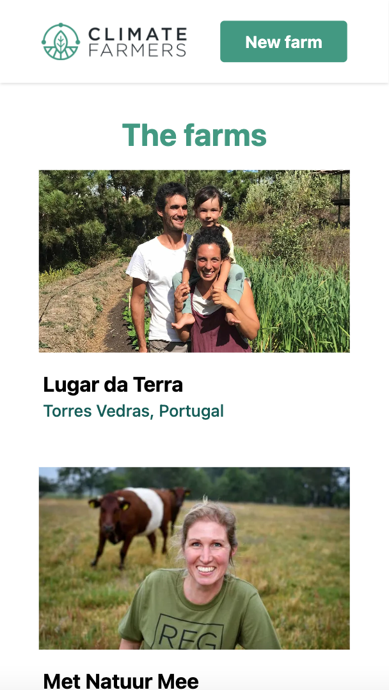
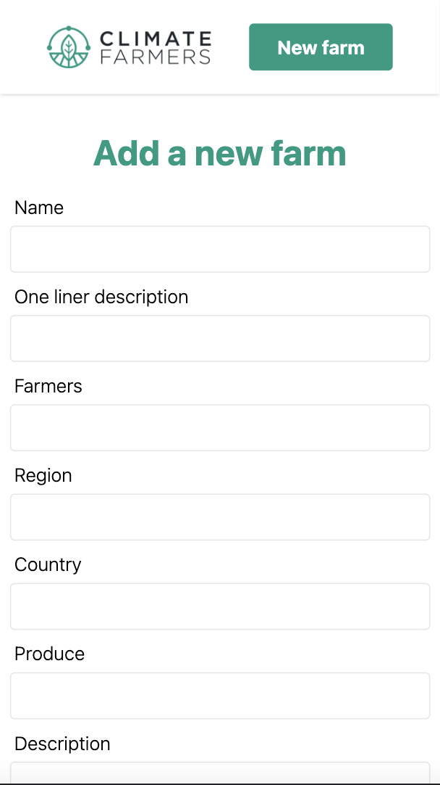
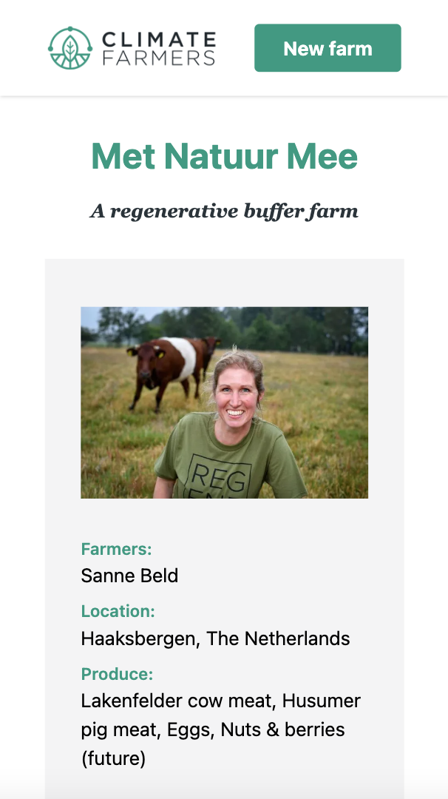

# Product Management System App

This app is a responsive web application made for users to manage their products.


<p align="center" display="flex" gap="3px">
  
  
  
</p>


## Features

- Users can add, remove, edit and retrive products
  

## Tech Stack

### Front End

- [React](https://reactjs.org/) - Front end development
- [Tailwind](https://tailwindcss.com/) - Styling and responsiveness

### Back End

- [Express](https://expressjs.com/) - Backend framework for Node.js
- [MongoDB](https://www.mongodb.com/) - Database and Atlas for DB hosting
- [Mongoose](https://mongoosejs.com/) - Mongo ODM

  
## Getting started

#### 1. Run npm install in both the server and client folders

```
npm install
```


#### 2. Turn on the server

```
cd server
nodemon index.js
```


#### 3. Run the React client from another terminal

``` 
cd client
npm start
```

#### Run tests

``` 
cd client
npm test
```


## Author

Ana Ferrari Firmo - [Github](https://github.com/aferrarifirmo) - [LinkedIn](https://www.linkedin.com/in/ana-ferrari-firmo)


## Content

For development purposes I used the farms Climate Farmers partner with as content.
The logo, images and content belong to [Climate Farmers](https://www.climatefarmers.org/)

